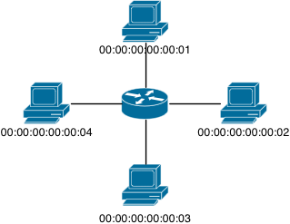

Chapter 7: Firewall Redux
=========================

In [Chapter 3](03-OxFirewall), you wrote a firewall that blocks ICMP traffic using OpenFlow and Ox. You did this in two steps: first, you wrote a _packet_in_ function and then configured the flow table to implement the same function efficiently. 
This single-line Frenetic program does the same thing: `if dlTyp = 0x800 && nwProto = 1 then drop else all`. 

In this chapter, you'll implement a more interesting firewall policy. This time, you will still use a trivial, one-switch topology. But, in the next chapter, you'll see 
that your firewall is easy to reuse and apply to any other topology.

## Topology 

You are going to program the following network of four hosts and one switch:



The host with MAC address `00:00:00:00:00:0n` is connected to port `n`. Mininet has builtin support for building single-switch topologies:

```
$ sudo mn --controller=remote --topo=single,4 --mac --arp
```

### Exercise 1: Routing

Write a routing policy for this network. Use `monitorTable` to examine the flow table that the compiler generates. Try a few `ping`s between hosts.

As you've seen, Frenetic supports ordinary `if`-`then`-`else` expressions.
So, you can implement the routing policy as follows:

```
let routing =
  if dlDst=00:00:00:00:00:01 then
     fwd(1)
  else if (* destination is 2, forward out port 2, etc. *)
    ...
  else
    drop
    
monitorTable(1, routing)
```

Fill in the rest of the policy by editing [Chapter7.nc](netcore-tutorial-code/Chapter7.nc). 

#### Testing

Launch Frenetic in one terminal:

```
$ frenetic Chapter7.nc
```

And Mininet in another:

```
$ sudo mn --controller=remote --topo=single,4 --mac --arp
```

Using Mininet, ensure that you can ping between all hosts:

```
mininet> pingall
```

## Access Control Policy

Now that basic connectivity works, you should enforce the access control policy written in the table below:

<table>
<tr>
  <th style="visibility: hidden"></th>
  <th style="visibility: hidden"></th>
  <th colspan="4">Server MAC address</th>
</tr>
<tr>
  <th style="visibility: hidden"></th>
  <th style="visibility: hidden"></th>
  <th>00:00:00:00:00:01</th>
  <th>00:00:00:00:00:02</th>
  <th>00:00:00:00:00:03</th>
  <th>00:00:00:00:00:04</th>
</tr>
<tr>
  <th rowspan="5" style="-webkit-transform:rotate(270deg)" >
    Client MAC<br>address
  </th>
  <th>00:00:00:00:00:01</th>
  <td>HTTP, SMTP</td>
  <td>HTTP, SMTP</td>
  <td>Deny All</td>
  <td>HTTP</td>
</tr>
<tr>
  <th>00:00:00:00:00:02</th>
  <td>HTTP, SMTP</td>
  <td>HTTP, SMTP</td>
  <td>Deny All</td>
  <td>HTTP</td>
</tr>
<tr>
  <th>00:00:00:00:00:03</th>
  <td>HTTP, SMTP</td>
  <td>SMTP</td>
  <td>HTTP, SMTP</td>
  <td>HTTP, SMTP</td>
</tr>
<tr>
  <th>00:00:00:00:00:04</th>
  <td>HTTP, SMTP</td>
  <td>SMTP</td>
  <td>HTTP, SMTP</td>
  <td>HTTP, SMTP</td><br>
</tr>
</table>

Each cell in this table has a list of allowed protocols for connections between
clients (rows) and servers (columns). For example, consider the top-right corner of the table:


<table>
<tr>
  <th></th>
  <th>00:00:00:00:00:04</th>
</tr>
<tr>
  <th>00:00:00:00:00:01</th>
  <td>HTTP</td>
</tr>
</table>

This cell indicates that HTTP connections (port 80) are allowed between client
`00:00:00:00:00:01` and the server `00:00:00:00:00:04`. To realize this policy in Frenetic, you need to allow packets from the client to port 80 on the server *and* from port 80 on the server to the client:

```
if (dlSrc = 00:00:00:00:00:01 && dlDst = 00:00:00:00:00:04 && tcpDstPort = 80) ||
   (dlSrc = 00:00:00:00:00:04 && dlDst = 00:00:00:00:00:01 && tcpSrcPort = 80)
then
  routing
else
  drop
```

### Exercise 2: Firewall + Routing

Wrap the routing policy you wrote above within a fire-walling policy.
Assume standard port numbers:

- HTTP servers are on port 80 and 
- SMTP servers are on port 25.

> See [Sol_Chapter7_Routing.nc](netcore-tutorial-code/Sol_Chapter7_Routing.nc), if you
> did not finish the previous task.

Your edited file will probably have the following structure:

```
let routing = (* from part 1, above *)

let firewall =
  if (* traffic is allowed *) then
    routing
  ...
  else
    drop

firewall
```

While you could write the policy by enumerating each allowed flow, consider
using `if`-`then`-`else` and boolean expressions (`p1 && p2`, `p1 || p2`, and `!p`) to write a compact and legible policy.

#### Testing

Launch Frenetic in one terminal:

```
$ frenetic Chapter7.nc
```

And Mininet in another, then open a terminal on each host:

```
$ sudo mn --controller=remote --topo=single,4 --mac --arp
mininet> xterm h1 h2 h3 h4
```

For test servers, just run _fortune_ on port 80 and 25.

Instead of trying a comprehensive test, just test a few points of the access control policy. For example, if you run _fortune_ on port 25 on `h4`:

```
## Run on h4's terminal
$ while true; do fortune | nc -l 25; done
```

Then, running `curl 10.0.0.4:25` should succeed from `h3`, but fail form `h2`.

## Next chapter: [Multi-switch Programming][Ch8]

[Ch8]: 08-NCMultiSwitch

[Action]: http://frenetic-lang.github.io/frenetic/docs/OpenFlow0x01.Action.html
